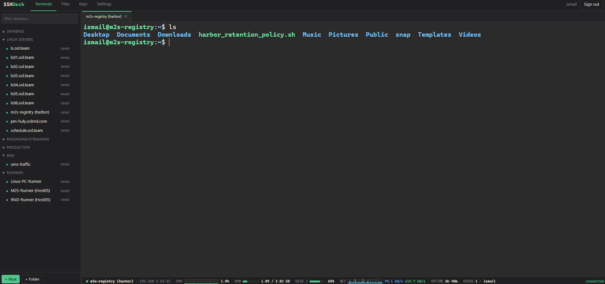

# SSHDeck

**Self-hosted web SSH client** — the MobaXterm / Termius experience in your browser, running from a single Docker container. Save unlimited sessions, open terminals in tabs, browse files over SFTP, drag files **directly between two servers**, and watch live host metrics — all without installing anything on your machines.

> Built for homelab / internal-network use. It stores credentials to your fleet — run it behind a VPN, never on the public internet.



## Features

**Terminal**
- Full xterm.js terminal with tabs, 256-color, tmux/vim/nano friendly
- **Press Enter to reconnect** a dropped session in place — same tab, scrollback intact (perfect for host reboots: keep hitting Enter until the box is back)
- VS Code-style font zoom (Ctrl+scroll / Ctrl+±), thin bar cursor
- Moba-style copy/paste: select-to-copy, middle-click paste, Ctrl+Shift+C/V, browser right-click menu untouched
- Client-side output highlighting (IPs, MACs, UP/DOWN keywords) — auto-disabled inside full-screen apps, toggleable in Settings

**Monitoring bar** (agentless — read over the same SSH connection, 0.5s refresh)
- CPU with 60-second sparkline graph
- RAM / DISK usage meters
- Network up/down rates with 60-second graph
- Uptime, and logged-in users with per-user session counts (`ismail×2 devops`) — hover for the full `who` detail

**Sessions**
- Unlimited saved hosts, organized in **nested folders** (any depth), with instant filter and natural sorting (`base, 1, 2, … 10` — never `1, 10, 2`)
- Drag & drop hosts and folders into folders; drag tabs to reorder (animated live preview); right-click context menus with host duplicate and sub-folder creation
- **Identities**: save a username+password pair once, pin it to any number of hosts; rotate the password in one place
- SSH key auth — private keys stored encrypted, never sent to the browser
- Resizable sidebar, searchable host picker in the file manager
- MobaXterm `.mobaconf` import (bookmarks + folders) and export
- Full native backup/restore: one JSON with folders, hosts, identities and keys (credentials included) — restores on any SSHDeck instance

**Files (SFTP)**
- Dual-pane file manager, each pane on any host
- **Host-to-host transfer**: drag files/directories from one pane to the other — streamed server-side, never touches your PC
- Multi-select (Ctrl/Shift+click), upload via drag from desktop, download, mkdir, rename, chmod, recursive delete
- Live transfer progress list
- Searchable host picker per pane; ⏻ releases the pane's SFTP session without touching open terminals

**Tunnels (port forwarding)**
- Local forwards through any saved host: `<sshdeck-server>:PORT` → SSH host → destination
- Saved tunnel definitions with one-click start/stop and live status
- Container publishes ports 15000–15020 for tunnels by default (adjust in `docker-compose.yml`)
- (X11 forwarding is intentionally out of scope — a browser has no X server to draw on; that's desktop-app territory)

**Platform**
- Multi-user: sign up / sign in, every user has their own sessions, keys, identities
- Theme JSON: paste a JSON in Settings to restyle the whole UI + terminal; share the file with anyone
- All state in `./data` (SQLite + encryption key) — copy the folder to move the app, delete it for a fresh start
- Structured logs to stdout — `docker logs sshdeck` shows connects, transfers, failures

## Quick start

```bash
git clone https://github.com/zeeglyismail/sshdeck.git && cd sshdeck
docker compose up -d --build
```

Open http://localhost:8022, sign up, add hosts (or Settings → import your `.mobaconf`).

## Architecture

Modular monolith — one container, one shared SSH connection pool, one feature per module:

```
app/
├── main.py            # FastAPI app assembly, session middleware, error handler
├── db.py              # SQLite (+ automatic schema migrations)
├── crypto.py          # Fernet encryption for stored secrets, key in /data
├── auth.py            # bcrypt password hashing, session dependency
├── ssh_manager.py     # pooled asyncssh connections: one per (user, host),
│                      #   shared by terminal, SFTP, stats and transfers
├── ws.py              # WebSockets: /ws/term (PTY) and /ws/stats (metrics)
├── mobaconf.py        # MobaXterm bookmark format parser/generator
└── routers/           # one REST module per feature
    ├── account.py     # signup / login / session
    ├── inventory.py   # folders + hosts
    ├── credentials.py # identities + SSH keys
    ├── sftp.py        # file manager operations
    ├── transfers.py   # server-side host-to-host copy
    └── portability.py # mobaconf import/export
static/                # no-build frontend: vanilla JS + xterm.js (vendored)
```

Why not microservices? The SSH connection pool is the heart of the app — terminal, SFTP, stats and transfers all multiplex channels over the *same* connection per host. Splitting features into separate processes would force one SSH connection per service (or an RPC layer around the pool) for zero gain at this scale. The router-per-feature layout gives the same isolation for development: add a feature = add a module.

### Monitoring internals

No agents. Every stats tick runs one command over a channel of the pooled connection reading `/proc/stat`, `/proc/meminfo`, `df`, `/proc/net/dev`, `/proc/uptime`, `who` — rates and deltas are computed server-side and pushed over the stats WebSocket.

### Host-to-host transfers

The server opens SFTP sessions to both hosts and pipes read→write in 1 MB chunks. Progress is tracked in memory and polled by the UI. Your browser only carries the *instruction*, not the bytes.

## Data & backup

Everything lives in `./data`:

| File | Purpose |
|---|---|
| `sshdeck.db` | SQLite — users, folders, hosts, identities, keys (secrets encrypted) |
| `secret.key` | Fernet key encrypting all stored secrets |

Back up both **together** — the DB is unreadable without the key. Move the app by copying the folder. Fresh start: `docker compose down`, delete `./data`, `docker compose up -d`.

## Security notes

- Internal networks / VPN only. Put HTTPS (reverse proxy) in front if it leaves localhost.
- Stored passwords/keys are encrypted at rest (Fernet, key on disk beside the DB — disk access = game over, so protect the host).
- Session cookies are signed; passwords hashed with bcrypt.
- SSH host keys are currently **not verified** (`known_hosts=None`) — acceptable on a LAN, on the roadmap to make strict.

## Roadmap / ideas

- Theme gallery + more built-in themes
- Manual sort order for sessions
- SSH host key verification (TOFU)
- Transfer acceleration for very large files (streamed exec instead of SFTP)
- Remote / dynamic (SOCKS) forwarding on top of the local tunnels
- Native desktop binaries (PyInstaller, Windows first) alongside Docker
- TOTP two-factor login

## License

MIT
