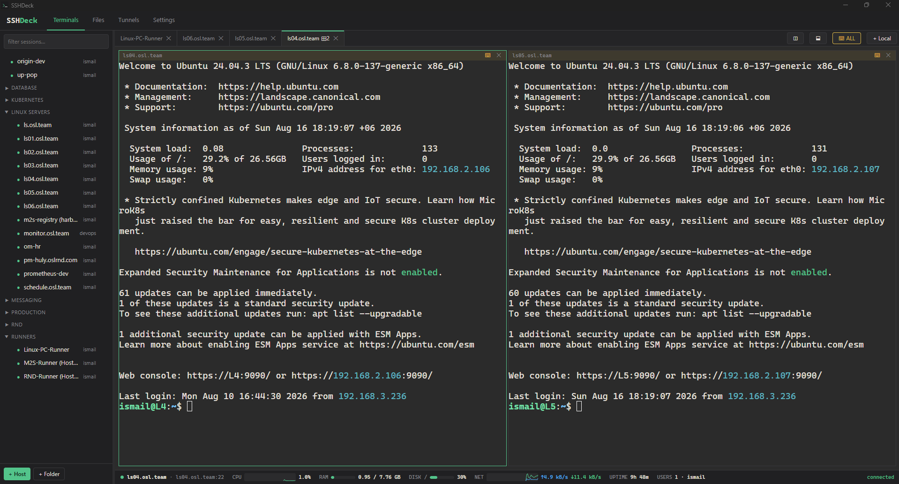

# SSHDeck

**A MobaXterm/Termius-style SSH client you own** — split terminals, dual-pane SFTP with **server-to-server transfers**, port forwarding, and live host monitoring.

Two editions from one repo:

| | **Desktop** (Windows) | **Web** (Docker) |
|---|---|---|
| Install | [**Download SSHDeck v1.0.0**](https://github.com/zeeglyismail/sshdeck/releases/latest) — 2.2 MB installer, no admin needed | `docker compose up -d` → http://localhost:8022 |
| Stack | Rust + Tauri 2 (5.7 MB exe, ~29 MB RAM, 0.3 s cold start) | FastAPI + asyncssh + SQLite |
| Best for | Daily driver on your machine — native window, local terminals, splits | Team/self-hosted, reachable from any browser, multi-user |



> Built for homelab / internal-network use. It stores credentials to your fleet — keep the web edition behind a VPN, never on the public internet.

---

## Features

Everything below is in **both** editions unless marked.

**Terminal**
- xterm.js terminals with tabs, 256-color, tmux/vim/nano friendly
- **Split panes** — split right/down, nestable; each split can be a **local shell (PowerShell/cmd/WSL) or any saved host** *(desktop)*
- **MultiExec** — type once, every split in the tab receives it; per-split opt-out *(desktop)*
- **Press Enter to reconnect** a dropped session in place — same tab, scrollback intact (perfect for reboots)
- Drag tabs to reorder with a live re-flow preview; middle-click closes a tab
- Moba-style copy/paste: select-to-copy, middle-click paste, Ctrl+Shift+C/V
- Font zoom (Ctrl+scroll / Ctrl+±), configurable scrollback (default 50 000 lines)
- Output highlighting — IPs, MACs, UP/DOWN keywords — auto-off inside full-screen apps, toggleable
- Cursor style: bar / block / underline × phase (VS Code expand) / blink / steady *(desktop)*
- Local terminal tabs *(desktop)*

**Monitoring bar** — agentless, over the same SSH connection
- CPU with 60-second sparkline, RAM and disk meters
- Network up/down rates with a 60-second graph
- Uptime, and logged-in users with per-user session counts (`ismail×2 devops`) — hover for the full `who` detail

**Sessions**
- Unlimited saved hosts in **nested folders** (any depth), instant filter, natural sorting (`base, 1, 2, … 10` — never `1, 10, 2`)
- Drag hosts and folders between folders; right-click for rename / sub-folder / duplicate host
- **Identities** — save a username+password once, pin it to any number of hosts, rotate in one place
- SSH key auth — private keys stored encrypted, never sent to the UI
- Deleting an identity/key never blocks: hosts fall back to password auth; deleting a folder asks whether to keep or delete the hosts inside
- Resizable sidebar, searchable host picker in the file manager

**Files (SFTP)**
- Dual-pane file manager, each pane on any host
- **Host-to-host transfer** — drag files/directories between panes; streamed by the app, never through your PC
- Multi-select (Ctrl/Shift+click), upload, download, mkdir, rename, chmod, recursive delete, live progress
- Release a pane's file session without touching open terminals

**Tunnels (port forwarding)**
- **Local (-L)** — reach a service on/behind a server from your machine
- **Remote (-R)** and **SOCKS5 (-D)** proxy *(desktop; web edition has local forwards)*
- Saved definitions, one-click start/stop, live status
- Desktop binds on your own machine — no container port ranges to configure

**Portability & theming**
- MobaXterm `.mobaconf` **import and export** (bookmarks + nested folders)
- Full backup **export/import**: one JSON with folders, hosts, identities and keys — moves your whole setup between editions/machines
- 5 built-in themes (`zeegly`, Dracula, Nord, One Dark, Gruvbox) + paste-your-own theme JSON *(desktop)*; theme JSON *(web)*
- Factory reset with type-to-confirm *(desktop)*; close-warnings for live sessions *(desktop)*
- Multi-user sign up / sign in *(web)*

---

## Desktop edition (Windows)

**[Download the installer →](https://github.com/zeeglyismail/sshdeck/releases/latest)** (`SSHDeck_1.0.0_x64-setup.exe`, 2.2 MB)

Per-user install, no admin prompt, Start-menu + desktop shortcuts, uninstaller included.
Windows SmartScreen will warn on first run because the binary isn't code-signed — *More info → Run anyway*.

Data lives in `%APPDATA%\cloud.onnorokom.sshdeck` (SQLite + AES-GCM key). Coming from the web edition? Settings → **Restore backup** with a `sshdeck-backup.json` export.

### Build from source

```bash
cd rust/src-tauri
cargo build --release     # exe       → target/release/sshdeck-desktop.exe
cargo tauri build         # installer → target/release/bundle/nsis/
```
Needs Rust (MSVC toolchain), VS Build Tools C++ workload, and `cargo install tauri-cli --locked`.

## Web edition (Docker)

```bash
git clone https://github.com/zeeglyismail/sshdeck.git && cd sshdeck
docker compose up -d --build
```

Open http://localhost:8022, sign up, add hosts (or Settings → import your `.mobaconf`).

---

## Architecture

Two frontends, the same ideas, no shared runtime:

```
app/                      # web edition — FastAPI (modular monolith)
├── ssh_manager.py        #   pooled asyncssh connections: one per (user, host),
│                         #   shared by terminal, SFTP, stats and transfers
├── ws.py                 #   WebSockets: /ws/term (PTY) + /ws/stats (metrics)
├── db.py crypto.py auth.py mobaconf.py
└── routers/              #   one REST module per feature
    account · inventory · credentials · sftp · transfers · tunnels · portability
static/                   # no-build frontend: vanilla JS + xterm.js (vendored)

rust/                     # desktop edition — Tauri 2
├── src-tauri/src/
│   ├── ssh.rs            #   russh connections + pool; password → keyboard-interactive auth
│   ├── sftp.rs           #   russh-sftp browse/transfer with progress events
│   ├── tunnels.rs        #   local (-L), remote (-R), SOCKS5 (-D)
│   ├── export.rs         #   backup JSON + mobaconf import/export
│   └── db.rs crypto.rs portability.rs main.rs
└── ui/                   # same vanilla JS + xterm.js approach, embedded in the exe
```

**Why not microservices?** The SSH connection pool is the heart of the app — terminal, SFTP, stats and transfers all multiplex channels over the *same* connection per host. Splitting them into services would force one connection per service for zero gain. Feature-per-module gives the same isolation for development.

**Monitoring internals** — no agents: one command per tick reads `/proc/stat`, `/proc/meminfo`, `df`, `/proc/net/dev`, `/proc/uptime`, `who`; deltas and rates are computed app-side.

**Host-to-host transfers** — the app opens SFTP sessions to both hosts and pipes read→write in chunks. The UI only carries the *instruction*, not the bytes.

## Data & backup

| Edition | Location | Files |
|---|---|---|
| Web | `./data` next to `docker-compose.yml` | `sshdeck.db` + `secret.key` (Fernet) |
| Desktop | `%APPDATA%\cloud.onnorokom.sshdeck` | `sshdeck.db` + `secret.key` (AES-256-GCM) |

Back up both files **together** — the DB is unreadable without the key. For moving between machines or editions, prefer Settings → **Export backup (.json)**.

## Security notes

- Internal networks / VPN only. Put HTTPS in front of the web edition if it leaves localhost.
- Stored secrets are encrypted at rest; the key sits beside the DB, so protect the host.
- Web edition: signed session cookies, bcrypt password hashing.
- SSH host keys are **not yet verified** — acceptable on a LAN, TOFU verification is on the roadmap.

## Roadmap

- SSH host key verification (TOFU)
- Linux/macOS desktop builds via CI matrix
- Transfer acceleration for very large files (streamed exec instead of SFTP)
- Manual sort order for sessions, more built-in themes
- X11 forwarding on desktop via a user-installed X server (VcXsrv)
- TOTP two-factor login (web)

## License

MIT
